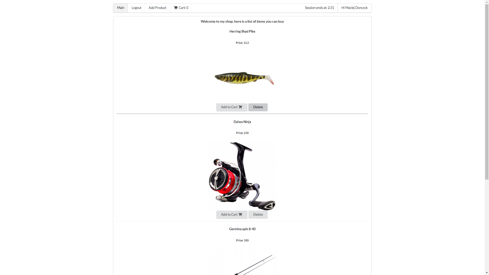

# EasyCatch - fishing shop
Project for classes created with ASP.NET, React.js and PostgreSql.

For the first x commits I used different git account - RybczanSodu, idk why.

**Technologies**
**Back**:
* .Net 5
* Entity Framework Core with PostgreSql: 3.1.3
* JwtBearer: 3.1.3

**Front**:
* React.js: 16.13.1
* event-emitter: ^0.3.5
* jwt-decode: ^2.2.0
* uuid: ^8.0.0
* react-router-dom ^5.2.0

App has proper routes to the place you are currently at, example -> registering: http:localhost:3000/Register etc.
      
## Setup
To run the API project, type dotnet run in EasyCatch.Api/EasyCatch.Web,
install react locally by typing npm install in EasyCatch.SPA
and npm start in EasyCatch.SPA to start the app

**Using API:**
```
      Controllers:
                Authentication:
                               localhost:port/api/authentication/register - post
                                                                      - json schema:
                                                                      {
                                                                        "login": "login",
                                                                        "password": "Password220@",
                                                                        "email": "mail@mail.pl",
                                                                        "name": "Name",
                                                                        "surname": "Surname"
                                                                      }
                               localhost:port/api/authentication/login - post
                                                                   - json schema:
                                                                   {
                                                                   "login": "login",
                                                                   "password": "password"
                                                                   }                                              
                Order:
                      localhost:port/api/order/createorder - no json needed
                      localhost:port/api/order/addProduct - patch to add product to order
                                                      - json schema: 
                                                      {
                                                        "orderId": "09e1bc7d-8809-4b5d-b43c-5d9051f57dc7",
                                                        "productId": "ccc42f26-b3a8-4656-beef-71e8d4baeaca"
                                                      }
                      localhost:port/api/order/orderId - get to get an order info
                                                   - no json needed
                      localhost:port/api/order/setaddress - patch to set order address
                                                      - json schema:
                                                      {
                                                        "street": "street",
                                                        "housenumber": "housenumber",
                                                        "postcode": "postcode",
                                                        "city", "city"
                                                      }
                      localhost:port/api/order/orderId - delete to delete an order
                                                   - as OrderId type actual orderId
                Product:
                      localhost:port/api/product/add - post to create a new product
                                                 - json schema: 
                                                 {
                                                    "name": "ProductName",
                                                    "price": 2.5,
                                                    "description": "ProductDescription",
                                                    "quantity": 15
                                                  }
                                                  - also file needed as a Product photo
                      localhost:port/api/product/productId - delete to delete a product
                                                     - as productId type actual productId
                      localhost:port/api/product/productId - get to get a product
                                                     - as productId type actual productId

```
### Main

### Register
 
### Register errors
 
### Admin logged in
 
### Admin deleted product from shop
 
### Adding Products
 
### Cart
 
### Deleted Product
 
